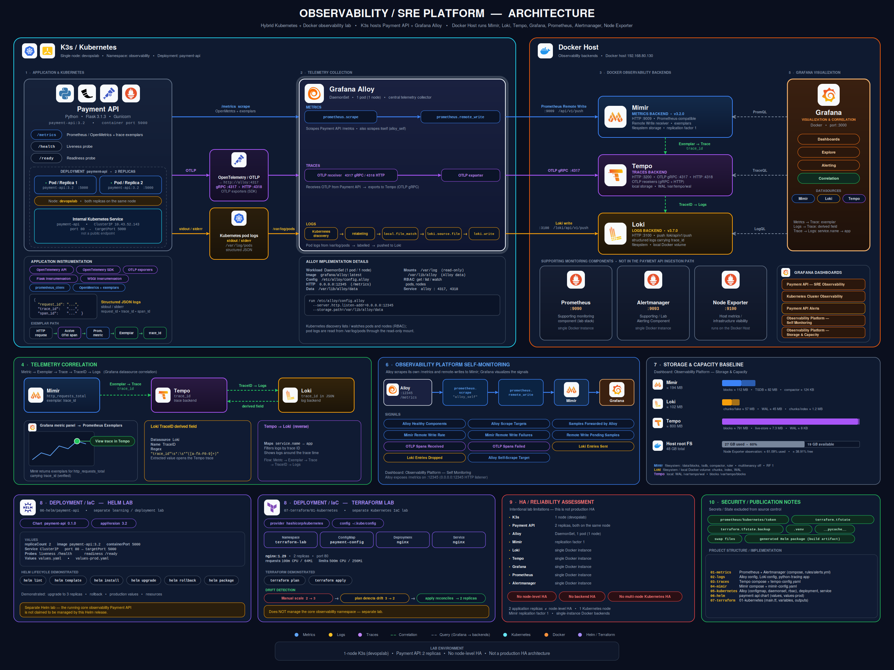
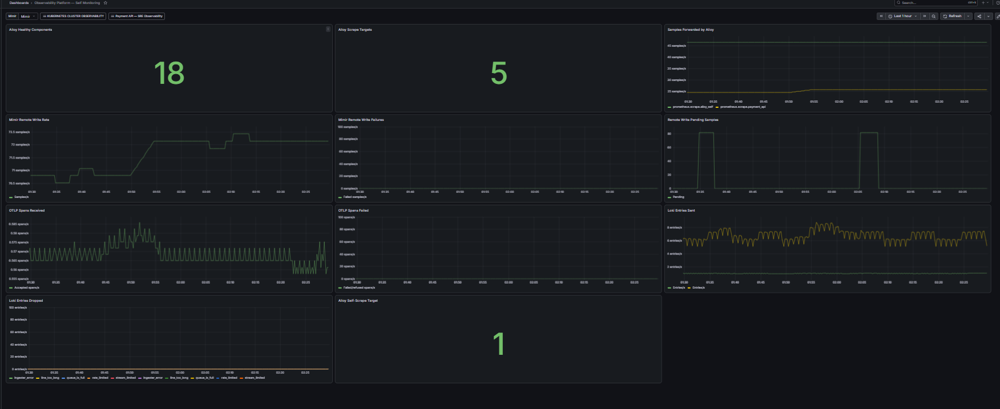

# Observability Platform — Kubernetes & Grafana Stack

[](#)
[](#)
[](#)
[](#)
[](#)
[](#)
[](#)

> A hands-on, end-to-end SRE / Observability lab built around a real containerized Payment API — demonstrating metrics, logs, and traces collection, processing, storage, correlation, and self-monitoring on a hybrid Kubernetes + Docker stack.

---

## Table of Contents

1. [Project Summary](#project-summary)
2. [Architecture Overview](#architecture-overview)
3. [Technology Stack](#technology-stack)
4. [End-to-End Telemetry Flows](#end-to-end-telemetry-flows)
5. [Metrics Pipeline](#metrics-pipeline)
6. [Logging Pipeline](#logging-pipeline)
7. [Tracing Pipeline](#tracing-pipeline)
8. [OpenTelemetry: What It Actually Is Here](#opentelemetry-what-it-actually-is-here)
9. [Correlation: Exemplars & Trace-to-Logs](#correlation-exemplars--trace-to-logs)
10. [Grafana Dashboards](#grafana-dashboards)
11. [Grafana Alloy Architecture](#grafana-alloy-architecture)
12. [Self-Monitoring the Observability Platform](#self-monitoring-the-observability-platform)
13. [Storage & Capacity](#storage--capacity)
14. [Kubernetes Layer](#kubernetes-layer)
15. [Helm Packaging Lab](#helm-packaging-lab)
16. [Terraform IaC Lab](#terraform-iac-lab)
17. [SRE Troubleshooting & Investigation Workflow](#sre-troubleshooting--investigation-workflow)
18. [High Availability Assessment](#high-availability-assessment)
19. [Security & Repository Hygiene](#security--repository-hygiene)
20. [Project Structure](#project-structure)
21. [Documentation Index](#documentation-index)
22. [Known Limitations](#known-limitations)
23. [Future Improvements](#future-improvements)
24. [Author](#author)

---

## Project Summary

This repository documents a hands-on observability lab built to understand and demonstrate how a real telemetry pipeline works — not just how to build a Grafana dashboard.

The core workload is a containerized **Payment API** deployed on **Kubernetes (K3s)**. Its telemetry — metrics, logs, and traces — is collected by **Grafana Alloy** and shipped to a Grafana observability backend (**Mimir**, **Loki**, **Tempo**) running via **Docker Compose**, then visualized and correlated in **Grafana**.

The project deliberately goes beyond "install Grafana and look at graphs." It covers:

- Collecting metrics, logs, and traces from a real application
- Understanding *why* each telemetry pipeline component exists
- Verifying correlation between metrics, traces, and logs (exemplars, TraceID linking)
- Monitoring the health of the observability platform itself
- Investigating storage growth and capacity behavior
- Managing Kubernetes workloads, Helm releases, and Terraform-managed infrastructure
- Practicing SRE-style investigation and troubleshooting
- Honestly assessing what is — and is not — production-grade in this setup

> **This is a single-node lab environment.** It is explicitly **not** a production high-availability deployment. Every HA-related claim in this README is scoped accordingly — see [High Availability Assessment](#high-availability-assessment).

---

## Architecture Overview

The environment is a **hybrid Kubernetes + Docker** observability lab:

- **Kubernetes (K3s)** hosts the Payment API workload and the Kubernetes-native Grafana Alloy DaemonSet.
- **Grafana Mimir, Loki, Tempo, and Grafana** run as **Docker Compose** services, acting as the telemetry backend.
- The Kubernetes cluster currently has **one node**.



High-level data flow:

```
Payment API (Kubernetes)
  ├── /metrics          → Grafana Alloy → Mimir  (metrics storage)
  ├── stdout/stderr      → Kubernetes pod logs → Grafana Alloy → Loki  (log storage)
  └── OTLP traces        → Grafana Alloy → Tempo (trace storage)

Grafana
  ├── queries Mimir  → metrics
  ├── queries Loki   → logs
  └── queries Tempo  → traces
```

Grafana is the single pane of glass: it queries all three backends and provides cross-signal correlation (metric → trace → logs).

---

## Technology Stack

| Layer | Component | Role |
|---|---|---|
| Application | Payment API | Instrumented workload generating metrics, logs, and traces |
| Orchestration | Kubernetes (K3s) | Runs the Payment API and the Alloy DaemonSet |
| Collection / Routing | Grafana Alloy | Scrapes metrics, tails logs, receives OTLP traces, routes telemetry |
| Metrics Backend | Grafana Mimir | Prometheus-compatible long-term metrics storage |
| Logs Backend | Grafana Loki | Log aggregation and storage |
| Traces Backend | Grafana Tempo | Distributed trace storage |
| Instrumentation | OpenTelemetry | Application-level tracing SDK/API and OTLP protocol |
| Visualization | Grafana | Dashboards, alerting, cross-signal correlation |
| Runtime (backend) | Docker / Docker Compose | Runs Mimir, Loki, Tempo, Grafana |
| Packaging | Helm | Chart-based deployment lab for the Payment API |
| Infrastructure as Code | Terraform | Kubernetes resource management lab with drift detection |

---

## End-to-End Telemetry Flows

**Metrics:**
```
Payment API → /metrics → Alloy prometheus.scrape → Alloy prometheus.remote_write → Mimir → Grafana
```

**Logs:**
```
Payment API → stdout/stderr → Kubernetes node /var/log/pods → Alloy (discovery, relabeling,
local.file_match, loki.source.file) → loki.write → Loki → Grafana
```

**Traces:**
```
Payment API → OTLP gRPC (4317) → Alloy OTLP receiver → Alloy OTLP exporter → Tempo → Grafana
```

---

## Metrics Pipeline

The Payment API exposes **Prometheus/OpenMetrics-compatible** metrics on `/metrics`, including HTTP request metrics and business metrics. The exposition format supports **exemplars**.

Grafana Alloy discovers the Kubernetes Payment API targets and scrapes them.

```
Payment API
  → /metrics
  → Alloy prometheus.scrape
  → Alloy prometheus.remote_write
  → Mimir
  → Grafana
```

Mimir remote-write endpoint used by Alloy (private lab address — **not** a public production endpoint):

```
http://<mimir-lab-host>:9009/api/v1/push
```

> **Note:** The real IP used in the lab is an internal, private network address. It is intentionally not published here as if it were a reachable production endpoint.

---

## Logging Pipeline

Payment API logs are written to `stdout`/`stderr`. Kubernetes stores container logs under the node's pod log directory. Alloy discovers pods, applies relabeling, and tails matched log files.

```
Payment API
  → stdout/stderr
  → Kubernetes pod logs (node /var/log/pods)
  → Alloy (discovery → relabeling → local.file_match → loki.source.file → loki.write)
  → Loki
  → Grafana
```

Loki push endpoint (private lab address, not a production endpoint):

```
http://<loki-lab-host>:3100/loki/api/v1/push
```

Log lines carry structured fields used for correlation:

- `request_id`
- `trace_id`
- `span_id`

These identifiers are what make trace-to-log correlation possible (see [Correlation](#correlation-exemplars--trace-to-logs)).

---

## Tracing Pipeline

The Payment API is instrumented with **OpenTelemetry** and emits **OTLP** traces over gRPC.

```
Payment API
  → OTLP gRPC
  → Alloy OTLP receiver (0.0.0.0:4317)
  → Alloy OTLP exporter
  → Tempo
  → Grafana
```

Tempo endpoints:

| Protocol | Port |
|---|---|
| OTLP gRPC | 4317 |
| OTLP HTTP | 4318 |
| Tempo HTTP API (query) | 3200 |

Tempo currently uses **local filesystem storage** — sufficient for a single-node lab, not for durable multi-node production use.

---

## OpenTelemetry: What It Actually Is Here

A common point of confusion in observability stacks is treating OpenTelemetry as if it were "yet another backend service." It isn't, in this project:

| Component | What it actually is |
|---|---|
| **OpenTelemetry** | Instrumentation: SDKs/APIs inside the Payment API, plus the **OTLP** wire protocol used to emit trace data |
| **Grafana Alloy** | The collector/agent: scrapes metrics, tails logs, receives OTLP, and routes all three signals |
| **Mimir** | Metrics storage backend |
| **Loki** | Logs storage backend |
| **Tempo** | Traces storage backend |
| **Grafana** | Visualization and cross-signal correlation layer |

OpenTelemetry has no standalone process of its own in this architecture — it lives inside the application as instrumentation and as the transport protocol (OTLP) that carries trace data to Alloy.

---

## Correlation: Exemplars & Trace-to-Logs

Correlation is what turns three separate telemetry signals into a coherent investigation workflow. Two correlation paths were built and verified in this lab.

### Metrics → Traces (Exemplars)

The Payment API exposes OpenMetrics HTTP request metrics with **trace exemplars** — each sampled metric point can carry a `trace_id`.

Verified: querying `query_exemplars` against Mimir returns HTTP request exemplars containing a `trace_id`, and Grafana renders these as exemplar points overlaid on the metric graph. Clicking an exemplar jumps directly to the corresponding trace in Tempo.

```
Metric anomaly (e.g., latency spike)
      │
      ▼
   Exemplar
      │
      ▼
    Trace (Tempo)
      │
      ▼
  Span details
      │
      ▼
Correlated logs
```

This is the core SRE workflow the platform is built to support: go from "something looks wrong on a graph" to "here is the exact request and the exact log lines that explain it."

### Traces → Logs (TraceID Correlation)

Grafana's Loki datasource is configured with a **derived field** that extracts `trace_id` from log lines and links it to Tempo. Tempo is correspondingly configured to correlate back to Loki, using:

- Loki as the linked log datasource
- a search window of roughly **±1 minute** around the trace timestamp
- a `service.name` → application-name mapping
- Trace ID filtering **enabled**
- Span ID filtering **disabled**

```
Metrics
   │
   └── Exemplar
          │
          ▼
        Tempo (trace)
          │
          ▼
        Loki (correlated logs, filtered by TraceID, ±1 min window)
```

Together, these two links let an engineer move from a metric graph to a specific trace to the exact log lines for that request, without manually cross-referencing timestamps or IDs.

---

## Grafana Dashboards

### Payment API — SRE Observability

The primary dashboard, containing multiple sections:

- Golden Signals
- Business Metrics
- HTTP Traffic
- Request Rate
- Request Latency
- Latency Percentiles (incl. P95, P95 by endpoint)
- Payment Success Rate
- SLI Trend
- Error Budget
- Traces
- Logs

Because this dashboard is large, it is documented with multiple screenshots:

```
docs/screenshots/dashboard/overview.png
docs/screenshots/dashboard/performance.png
docs/screenshots/dashboard/traces.png
docs/screenshots/dashboard/logs.png
```

### Other Dashboards

- **Kubernetes Cluster Observability** — cluster/workload-level visibility for the K3s node
- **Payment API Alerts** — alert rule status for the application
- **Observability Platform — Self Monitoring** — health of the telemetry pipeline itself (see below)
- **Observability Platform — Storage & Capacity** — backend storage usage over time (see below)

> Dashboards and panels listed here reflect what is actually implemented in this lab. No panel names beyond what is documented above are claimed.

---

## Grafana Alloy Architecture

Kubernetes Grafana Alloy is the primary collection and routing agent for the Payment API telemetry path.

**Kubernetes deployment:**

- Deployed as a **DaemonSet** in the `observability` namespace
- Config mounted at `/etc/alloy/config.alloy`
- HTTP server listens on `0.0.0.0:12345`
- Storage path: `/var/lib/alloy/data`
- RBAC grants discovery permissions on pods and nodes
- Host `/var/log` mounted **read-only** for log collection

**Responsibilities:**

- Kubernetes service discovery
- Log collection (tailing pod log files)
- Metrics scraping (`/metrics` endpoints)
- OTLP trace receiving
- Telemetry routing to Mimir / Loki / Tempo
- Self-monitoring (exposing its own health metrics)

Because the cluster currently has **one node**, the DaemonSet currently schedules **one Alloy pod**. On a multi-node cluster, this would scale automatically — one Alloy instance per node.

---

## Self-Monitoring the Observability Platform

An observability platform that can't observe itself is a blind spot: if the collection pipeline silently fails, dashboards go quiet and it's easy to mistake "no data" for "no problem." This lab treats the telemetry pipeline itself as a monitored system.

Alloy exposes its own metrics on `127.0.0.1:12345`, which are scraped like any other target.

**Self-Monitoring dashboard — 11 panels:**

1. Alloy Healthy Components
2. Alloy Scrape Targets
3. Samples Forwarded by Alloy
4. Mimir Remote Write Rate
5. Mimir Remote Write Failures
6. Remote Write Pending Samples
7. OTLP Spans Received
8. OTLP Spans Failed
9. Loki Entries Sent
10. Loki Entries Dropped
11. Alloy Self-Scrape Target

Metrics verified as available and queryable:

- `alloy_component_graph_connection`
- `prometheus_forwarded_samples_total`
- `prometheus_target_sync_failed_total`
- `up{job="prometheus.scrape.alloy_self"} = 1`
- Alloy build information (via Mimir)



---

## Storage & Capacity

The **Storage & Capacity** dashboard tracks disk usage for each backend. The figures below are **lab baseline measurements taken at a point in time**, not sizing recommendations for production.

| Backend | Total | Breakdown |
|---|---|---|
| **Mimir** | ~194 MB | blocks ~112 MB · TSDB ~82 MB · compactor ~124 KB |
| **Loki** | ~102 MB | chunks/fake ~57 MB · WAL ~45 MB · chunks/index ~1.2 MB |
| **Tempo** | ~800 MB | blocks ~791 MB · live-store ~7.3 MB · WAL ~8 KB |

**Host root filesystem:**

| Metric | Value |
|---|---|
| Total | 48 GB |
| Used | 27 GB |
| Available | 19 GB |
| Usage | ~60% |

> These numbers describe this specific lab, at this point in time, with lab-scale traffic. Real capacity planning depends on ingestion rate, retention period, compression ratio, replication factor, storage backend choice, workload characteristics, and expected growth rate — none of which this baseline alone determines.

### Retention — a documented limitation

An attempt was made to configure Mimir retention explicitly:

```yaml
blocks_retention_period: 7d
```

This setting was **not supported** in the tested Mimir 3.2.0 configuration and was removed after the change failed. Retention behavior in this lab therefore reflects Mimir's defaults rather than an intentionally configured 7-day policy — this is documented here as an investigation result, not glossed over.

```
docs/screenshots/storage/storage-capacity.png
```

---

## Kubernetes Layer

**Namespace:** `observability`

**Payment API deployment:**

| Field | Value |
|---|---|
| Deployment name | `payment-api` |
| Replicas | 2 |
| Image | `payment-api:3.2` |
| Readiness probe | `/ready` |
| Liveness probe | `/health` |
| Service type | ClusterIP |
| Service port | 80 |
| Target port | 5000 |

Both replicas currently run on the **same single Kubernetes node**. This means:

- ✅ Application-level replica redundancy exists (2 pods, ClusterIP load balancing across them)
- ❌ Node-level high availability does **not** exist (a node failure takes down both replicas)

**Grafana Alloy** runs as a DaemonSet. With one node in the cluster, one Alloy pod is currently scheduled — this is expected DaemonSet behavior, not a limitation of Alloy itself.

```
docs/screenshots/kubernetes/cluster-runtime.png
```

---

## Helm Packaging Lab

A separate Helm lab packages the Payment API for reusable, versioned deployment — independent from the main hand-applied Kubernetes manifests used elsewhere in this project.

**Chart location:** `06-helm/payment-api`

```yaml
name: payment-api
version: 0.1.0
appVersion: 3.2
```

**Chart contents:**

- `Chart.yaml`
- `values.yaml`
- `values-prod.yaml`
- Deployment template
- Service template
- Helper templates

**Validated operations:**

- `helm lint`
- `helm template`
- `helm install`
- `helm upgrade`
- `helm rollback`
- Deployment against production-style values (`values-prod.yaml`)

> The main observability-namespace Payment API deployment described earlier in this README is **not** Helm-managed. This chart is a separate, standalone packaging exercise demonstrating Helm release lifecycle management.

```
docs/screenshots/automation/helm-upgrade-rollback.png
```

---

## Terraform IaC Lab

A separate Terraform lab demonstrates infrastructure-as-code fundamentals against the Kubernetes provider — independent of the observability namespace.

**Managed resources:**

- `terraform-lab` namespace
- ConfigMap
- Nginx Deployment
- Nginx Service

**Concepts demonstrated:**

- Kubernetes provider configuration
- Input variables and outputs
- Declarative resource definitions
- Desired-state reconciliation
- Drift detection

**Drift test performed:**

1. Manually scaled the Nginx deployment from 2 → 3 replicas (out-of-band change)
2. `terraform plan` detected the drift (reported 3 → 2)
3. The deployment was manually restored to the Terraform-defined **2 replicas** after the drift test

> Terraform in this lab manages only the `terraform-lab` namespace. It does **not** manage the `observability` namespace or any part of the core telemetry stack.

```
docs/screenshots/automation/terraform-drift-detection.png
```

---

## SRE Troubleshooting & Investigation Workflow

A structured investigation path used when something looks wrong, from application down to platform internals:

| # | Check | Why |
|---|---|---|
| 1 | Application health (`/health`, `/ready`) | Confirms the Payment API process is alive and ready to serve traffic |
| 2 | Kubernetes workload state (`kubectl get pods`, `kubectl describe`) | Confirms scheduling, restarts, and pod-level events |
| 3 | Service/endpoints (`kubectl get endpoints`) | Confirms the Service is actually routing to healthy pod IPs |
| 4 | Metrics availability (`/metrics`, Mimir query) | Confirms the metrics pipeline is producing and storing data |
| 5 | Logs availability (Loki query by pod/label) | Confirms log shipping is functioning |
| 6 | Trace availability (Tempo search) | Confirms traces are reaching the backend |
| 7 | Metric → exemplar → trace | Validates cross-signal correlation is intact, not just each signal in isolation |
| 8 | Trace → logs (TraceID derived field) | Confirms the Loki/Tempo correlation link is working |
| 9 | Alloy pipeline health (self-monitoring dashboard) | Confirms the collector itself isn't silently dropping data |
| 10 | Mimir remote-write status | Confirms ingestion isn't failing or backing up |
| 11 | Loki ingestion status | Confirms log entries aren't being dropped |
| 12 | Tempo OTLP ingestion | Confirms trace spans are being accepted |
| 13 | Storage growth (Storage & Capacity dashboard) | Confirms backends aren't approaching disk limits |
| 14 | HA limitations review | Frames any incident in terms of what redundancy actually exists |

Example commands used during investigation (only commands grounded in this actual environment):

```bash
# Kubernetes workload state
kubectl get pods -n observability -o wide
kubectl describe pod <payment-api-pod> -n observability

# Service and endpoint routing
kubectl get endpoints payment-api -n observability

# Alloy pipeline health
kubectl logs -n observability <alloy-pod> -c alloy

# Application readiness/liveness directly
kubectl exec -n observability <payment-api-pod> -- curl -s localhost:5000/health
kubectl exec -n observability <payment-api-pod> -- curl -s localhost:5000/ready
```

Each of these narrows down whether a problem is in the application, the Kubernetes scheduling layer, the telemetry collection layer, or the storage backend — rather than guessing.

---

## High Availability Assessment

This section is intentionally explicit: **this is a lab, not a production HA deployment.**

| Component | Current state | HA? |
|---|---|---|
| Kubernetes cluster | Single node | ❌ |
| Payment API | 2 replicas, same node | Partial (app-level only) |
| Grafana Alloy | DaemonSet, 1 pod (1 node) | ❌ (scales with nodes, but none to scale to) |
| Mimir | `replication_factor = 1` | ❌ |
| Loki | Single Docker instance | ❌ |
| Tempo | Single Docker instance, local filesystem storage | ❌ |
| Grafana | Single Docker instance | ❌ |
| Failure testing | Not performed | ❌ |

**What real production HA would additionally require:**

- Multiple Kubernetes nodes
- Pod anti-affinity / topology spread constraints for the Payment API
- Replicated backend services (Mimir with `replication_factor ≥ 3`, distributed Loki, clustered Tempo)
- Durable, distributed object storage (e.g., S3-compatible) instead of local filesystem
- Redundant Grafana instances behind a load balancer
- Deliberate failure/chaos testing (node loss, pod eviction, network partition)
- A defined backup and recovery strategy for each backend
- Capacity planning based on real ingestion/retention targets, not a single point-in-time baseline

None of the above is implemented in this repository. They are listed here to show the gap between "it works on a single-node lab" and "it would survive a node failure in production" — and to demonstrate that the distinction is understood.

---

## Security & Repository Hygiene

The repository intentionally excludes the following from version control:

- Kubernetes authentication tokens
- Terraform state (`terraform.tfstate`)
- Terraform state backups
- `.terraform/` directory
- Python virtual environment directories
- Python `__pycache__`
- Vim swap files
- Generated Helm `.tgz` packages

Any credentials, kubeconfig contents, or tokens required to run this project must be supplied locally by the operator — none are committed here. Private lab network addresses referenced throughout this README (e.g., the Mimir/Loki push endpoints) are internal to the lab environment and are not intended as public production endpoints.

---

## Project Structure

```
.
├── 01-metrics/        # Payment API metrics instrumentation & Alloy scrape config
├── 02-logs/           # Log collection configuration (Alloy discovery/relabeling → Loki)
├── 03-traces/         # OpenTelemetry instrumentation & OTLP trace configuration
├── 04-mimir/          # Mimir backend configuration (Docker Compose)
├── 05-kubernetes/     # Kubernetes manifests for Payment API + Alloy DaemonSet
├── 06-helm/           # Standalone Helm chart lab for the Payment API
│   └── payment-api/
├── 07-terraform/      # Standalone Terraform Kubernetes lab (terraform-lab namespace)
└── docs/              # Supporting documentation, diagrams, and screenshots
    ├── architecture/
    ├── screenshots/
    ├── telemetry/
    ├── operations/
    └── deployment/
```

---

## Documentation Index

Deeper write-ups per topic (see `docs/`):

| Document | Covers |
|---|---|
| `docs/telemetry/metrics.md` | Metrics pipeline detail, scrape config, exemplars |
| `docs/telemetry/logs.md` | Log collection detail, discovery/relabeling rules |
| `docs/telemetry/traces.md` | Tracing pipeline, OTLP configuration |
| `docs/telemetry/correlation.md` | Exemplar and TraceID correlation setup |
| `docs/operations/self-monitoring.md` | Alloy self-monitoring panels and metrics |
| `docs/operations/storage-capacity.md` | Storage baselines and capacity planning notes |
| `docs/operations/troubleshooting.md` | Full SRE investigation runbook |
| `docs/deployment/kubernetes.md` | Kubernetes manifests and deployment notes |
| `docs/deployment/helm.md` | Helm chart usage and release lifecycle |
| `docs/deployment/terraform.md` | Terraform lab usage and drift detection walkthrough |

> Some of these documents may still be in progress — this index reflects the intended documentation structure.

---

## Known Limitations

- Single Kubernetes node — no node-level HA
- Mimir `replication_factor = 1`
- Loki, Tempo, and Grafana each run as a single Docker instance
- Tempo uses local filesystem storage, not distributed object storage
- Mimir retention could not be explicitly configured in the tested version (defaults apply)
- No chaos/failure testing has been performed
- Alerting exists at the level of Grafana alert rules and dashboards; a fully documented alert-routing architecture (e.g., a verified Alertmanager integration) has not been established

## Future Improvements

- Expand the Kubernetes cluster to multiple nodes and re-test Alloy DaemonSet + Payment API scheduling across nodes
- Move Tempo (and potentially Loki/Mimir) to distributed object storage
- Increase Mimir `replication_factor` and re-validate ingestion under replica loss
- Perform controlled failure testing (node drain, pod eviction, network partition)
- Revisit and properly validate Mimir retention configuration on a supported version
- Formalize alert routing and document the Grafana alerting vs. Alertmanager boundary
- Migrate the main Payment API deployment to Helm-managed releases
- Extend Terraform management to cover the observability namespace itself

## Author

Built and documented as part of a hands-on SRE / Observability portfolio.

- **Role focus:** Site Reliability Engineering / Observability
- **Stack:** Kubernetes, Grafana Alloy, Mimir, Loki, Tempo, OpenTelemetry, Grafana, Docker, Helm, Terraform

---

*This README documents the project as it currently exists. Where a capability is not yet implemented or verified, it is explicitly marked as a future improvement or known limitation rather than presented as complete.*
